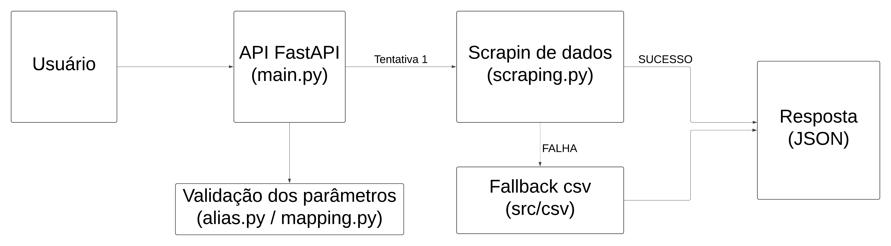

# Tech Challenge

Tech Challenge é um projeto que reúne os conhecimentos obtidos em todas as disciplinas da fase.

## O Problema

Você foi contratado(a) para uma consultoria e seu trabalho envolve analisar os dados de vitivinicultura da Embrapa.  
Site de origem dos dados: [http://vitibrasil.cnpuv.embrapa.br/index.php](http://vitibrasil.cnpuv.embrapa.br/index.php)

A ideia do projeto é a criação de uma API pública para consulta aos dados do site nas seguintes categorias:
- **Produção**
- **Processamento**
- **Comercialização**
- **Importação**
- **Exportação**

A API também deve recorrer a arquivos CSV locais caso o site esteja indisponível. Esses dados servirão futuramente como base para um modelo de Machine Learning.

---

## Descrição da API

A API foi desenvolvida usando o framework **FastAPI**. Sua funcionalidade principal é:
1. Fazer scraping dos dados do site da Embrapa.
2. Utilizar arquivos CSV locais como fallback quando o site estiver indisponível.

---

## Diagrama de Arquitetura



## Coleta de Dados:
- Web Scraper ➔ Dados brutos ou CSV backup

## Mapeamento e Processamento:
- Alias e mapeamento de parâmetros

## API:
- Endpoints de consulta de dados

## Consumo:
- Dashboards ou integrações

## Requisitos

- **Python 3.7 ou superior**
- **pip** (gerenciador de pacotes)

## Dependências

- **fastapi**
- **httpx**
- **chardet**
- **uvicorn**
- **beautifulsoup4**

## Instalação

1. Instale as dependências:
   ```bash
   pip install -r requirements.txt
   ```

2. Execute a aplicação:
   ```bash
   uvicorn main:app --reload
   ```

3. Acesse a documentação interativa no Swagger:
   ```bash
    http://127.0.0.1:8000/docs
    ```

## Endpoints

Obter Dados:

Método: GET

Rota: /dados/{ano}/{opcao}

## Parâmetros:
**ano (obrigatório):** Ano dos dados a serem buscados.

**opcao (obrigatório):** Categoria de dados (opt_02, opt_03, etc.).

**subopcao (opcional):** Subopção específica, como vinhos de mesa ou uvas frescas.

## Parâmetros Disponíveis:

**ano (int):** Ano para o qual os dados são solicitados.

**opcao (str):** *producao, processamento, comercializacao, importacao, exportacao*

## Mapeamento de Aliases

A API utiliza um sistema de aliases para facilitar o uso dos parâmetros de `opcao` e `subopcao`. Abaixo está o mapeamento:

| Categoria         | Subopção                     | opt       | subopt         |
|-------------------|------------------------------|-----------|----------------|
| **Produção**      | -                            | opt_02    | -              |
| **Processamento** | Viníferas                   | opt_03    | subopt_01      |
|                   | Americanas e Híbridas       | opt_03    | subopt_02      |
|                   | Uvas de Mesa                | opt_03    | subopt_03      |
|                   | Sem Classificação           | opt_03    | subopt_04      |
| **Comercialização**| -                           | opt_04    | -              |
| **Importação**    | Vinhos de Mesa              | opt_05    | subopt_01      |
|                   | Espumantes                  | opt_05    | subopt_02      |
|                   | Uvas Frescas                | opt_05    | subopt_03      |
|                   | Uvas Passas                 | opt_05    | subopt_04      |
|                   | Suco de Uva                 | opt_05    | subopt_05      |
| **Exportação**    | Vinhos de Mesa              | opt_06    | subopt_01      |
|                   | Espumantes                  | opt_06    | subopt_02      |
|                   | Uvas Frescas                | opt_06    | subopt_03      |
|                   | Suco de Uva                 | opt_06    | subopt_04      |

### Observações
- **Produção** e **Comercialização** não possuem subopções, logo o `subopt` é `None`.

- Todas as categorias com subopções (como **Processamento**, **Importação** e **Exportação**) estão mapeadas com seus respectivos valores `opt` e `subopt`.

Utilize esses aliases para facilitar suas requisições na API.

## Respostas:
**200 OK:** Retorna os dados solicitados.

**400 Bad Request:** O tipo de dados ou subopção solicitada é inválido.

**500 Internal Server Error:** Ocorreu um erro ao buscar os dados.

### Exemplo de Requisição
   ```bash
   curl -X GET "http://127.0.0.1:8000/dados/2023/opt_05" -H "accept: application/json"
   ```
   
### Organização dos Arquivos CSV
Os arquivos CSV devem ser colocados na pasta src/csv.

#### Nome dos arquivos:
Para requisições sem subopcao: opt_XX.csv (ex.: opt_02.csv).

Para requisições com subopcao: subopt_XX_opt_XX.csv (ex.: subopt_03_opt_05.csv).

O delimitador deve ser ; 

**Os cabeçalhos devem refletir o ano esperado.**

## Estrutura do Projeto

```plaintext
├── main.py            # Código principal da API
├── scraping.py        # Funções de scraping e fallback CSV
├── requirements.txt   # Dependências do projeto
├── src/
│   └── csv/           # Arquivos CSV locais
```